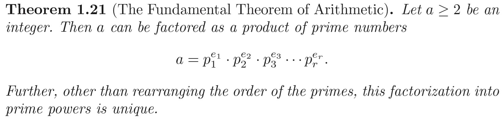

# Prime Factorization
In the Mathematical Cryptography one of the most Important theorem is that every positive integer has an essentially unique factorization as a product of primes.
>
*from An introduction to the mathematical cryptography (joseph H.silverman) Book*
### Implementation
We need to implement theorem for use its application in the **Mathematical cryptography** , so we need to find efficient algortihm for finding the prime fators of integers number.
one of the efficient way to finding prime factor for big integer use the **nextProbablePrime()** method in the **BigInteger class** of  java , and you can see in the PrimeFactors class in this repo. 
